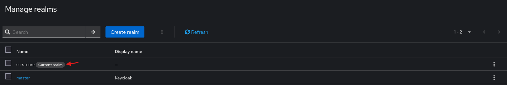
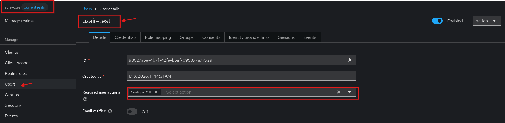
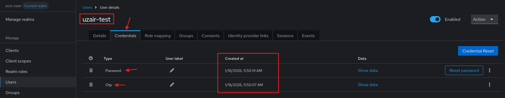

# Keycloak Core Configuration

A dedicated Keycloak realm is used to keep everything isolated and safe for testing.

## Configuration Steps
The Keycloak environment is configured with the following core components:

### 1- Realm Isolation
A dedicated Keycloak realm named **scrs-core** is created to provide logical isolation of users, authentication flows, and security controls.

***

   

***

### 2- User Provisioning
A test account **uzair-test** is created with temporary **Password** and **TOTP** to ensure consistent authentication behavior across automated and manual tests.

***

   

***

   

***
