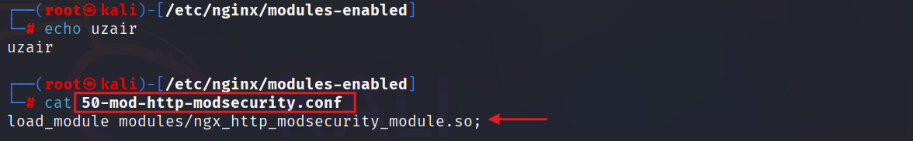

# Example Control: ModSecurity (Open-Source WAF)

To demonstrate the engine, I used ModSecurity as a reference open-source Web Application Firewall.

**ModSecurity provides:** _HTTP Request Inspection | Attack Detection and Blocking | Integration with the OWASP Core Rule Set_

# Phase 01 - Install Required Components

First update the system packages and install the required components:
- **Nginx** → Web server
- **ModSecurity** → WAF engine
- **OWASP CRS** → Attack detection rules

Use the following command:
```
sudo apt update -y
sudo apt install nginx libnginx-mod-http-modsecurity modsecurity-crs -y
```

## ModSecurity Module

Check for ModSecurity Module if enabled by following command:

```
cat /etc/nginx/modules-enabled/50-mod-http-modsecurity.conf
```

***
 

***

# Phase 02 - Configure ModSecurity Engine


