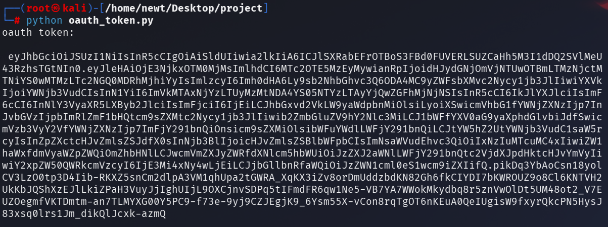

# Security-Control-Reliabilty-System
I’ve seen security controls fail silently, so I built a system that continuously verifies whether our controls are actually protecting us.

**Author:** Uzair Khan

# Overview

Modern security programs often assume that controls, safeguards, or protection mechanisms continue to work correctly once configured. In reality, these controls can silently fail, drift, or degrade over time due to misconfigurations, system updates, or integration issues.  
  
Instead of trusting configuration or dashboards, the engine executes real interactions against a security control and evaluates:

**- Whether the control enforces its policy**  
**- Whether security actions are visible**  
**- Whether detection happens within an acceptable latency**

The goal is to detect silent security failures before attackers do.

---
> ℹ️ **The architecture is tool-agnostic and can be extended to other platforms (IAM, WAF, EDR, firewalls, cloud controls)**    

---

***
<div align="center">
   
</div>

***

# Why This Matters

In real environments, security controls can degrade due to:

- Configuration drift

- Platform upgrades

- Integration failures

- Pipeline issues

Traditional tools often validate configuration, not runtime behavior.

# How the Engine Works

At a high level:

**- The engine loads an expected control state from configuration.**

**- Active probes execute real requests against the control.**

**- Runtime behavior is captured and analyzed.**

**- Observed behavior is compared against expectations.**

**- Drift, degradation, or failures trigger alerts.**

# Example Control: Keycloak (Open-Source IdP)  
To demonstrate the engine, I used **Keycloak** as a reference open-source security control.

**Keycloak provides:** _Authentication and Access Enforcement | Policy and Flow Configuration | Event and Audit Logging_

# Phase 01 — Keycloak Flow Configuration (**[Full Keycloak Configuration](https://github.com/uAckerman/Security-Control-Reliabilty-System/blob/main/Keycloak_config.md)** )

- A dedicated Keycloak realm **scrs-core** is created to isolate the environment.

- A test user **uzair-test** is provisioned with non-temporary credentials.

- MFA (TOTP) is configured and enforced in the authentication flow named as **Browser_Flow**.

- A confidential OAuth client is registered for OpenID Connect.

- Client credentials are generated for secure token exchange.

- Required realm-management roles are assigned for visibility and inspection.

***
<div align="center">
   
</div>

***

# Phase 02 — IDP Connection Layer

This layer authenticates machine identities using the OAuth2 client credentials flow and manages short-lived access tokens for service communication. It centralizes all Keycloak administrative API interactions, ensuring that security logic remains isolated and reusable.

## How it works
1. A service requests a machine token.
2. ```oauth_token.py``` performs OAuth2 Client Credentials authentication.
3. Keycloak issues an access token.
4. The token is injected into KeycloakClient.

| File | Responsibility |
|------|----------------|
| **[oauth_token.py](https://github.com/uAckerman/Security-Control-Reliabilty-System/blob/main/oauth_token.py)**  | Handles OAuth2 client credential authentication and token issuance |
| **[keycloak_client.py](https://github.com/uAckerman/Security-Control-Reliabilty-System/blob/main/keycloak_client_api.py)**  | All Keycloak API calls live here |

***
 

***

# Phase 03 — MFA Enforcement Probe 

This Probe validates whether **Multi-Factor Authentication (MFA)** is properly enforced by the Keycloak. It simulates a direct authentication attempt using only **username** and **password** and observes how the IdP responds.

## How it works
The probe uses the OAuth2 Resource Owner Password Credentials flow to attempt authentication with only primary credentials.  
The core logic lives in **[mfa_probe.py](https://github.com/uAckerman/Security-Control-Reliabilty-System/blob/main/mfa_probe.py)** and returns:

- HTTP status code (200 — MFA ❌, 400/401 — MFA ✅).
- Raw response body.
- Request duration.

# Phase 04 — Logging Visibility Probe
This probe ensures that login events generated by the Identity Provider are actually logged and available for monitoring in near real-time.  
The core logic lives **[logging_probe.py](https://github.com/uAckerman/Security-Control-Reliabilty-System/blob/main/logging_probe.py)**

- It evaluates whether a login event appears in the event stream within the expected delay.

# Phase 05 — Config (Defining the Security Truth)
This approach follows a policy-as-code pattern:

1. Controls are versioned.
2. Changes are auditable.
3. Expectations are explicit.
4. Enforcement is continuously validated.

This file **[expected_controls.yaml](https://github.com/uAckerman/Security-Control-Reliabilty-System/blob/main/expected_controls.yaml)** expresses security expectations in a human-readable, version-controlled format.  
**This configuration does not perform checks. It declares what must be true for the environment to be considered secure.**  
```
mfa:
  required: true
  enforcement_method: otp
  login_without_otp_allowed: false

logging:
  auth_events_required: true
  max_detection_delay_seconds: 10
```
# Phase 06 — Execution 
This file **[main.py](https://github.com/uAckerman/Security-Control-Reliabilty-System/blob/main/main.py)** will execute:

- Load declared security controls.
- Authenticate to the Identity Provider.
- Execute security probes.
- Evaluate results against policy.
- Trigger alerts on violations.
