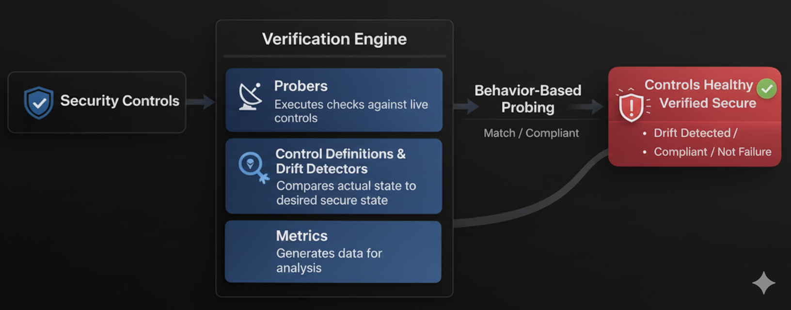
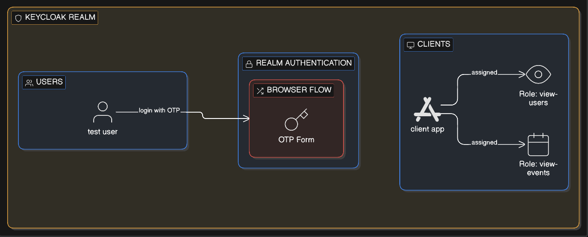

# Security-Control-Reliabilty-System
I’ve seen security controls fail silently, so I built a system that continuously verifies whether our controls are actually protecting us.

**Author:** Uzair Khan

# Overview

Modern security programs often assume that controls, safeguards, or protection mechanisms continue to work correctly once configured. In reality, these controls can silently fail, drift, or degrade over time due to misconfigurations, system updates, or integration issues.  
  
Instead of trusting configuration or dashboards, the engine executes real interactions against a security control and evaluates:

**- Whether the control enforces its policy**  
**- Whether security actions are visible**  
**- Whether detection happens within an acceptable latency**

The goal is to detect silent security failures before attackers do.

---
> ℹ️ **The architecture is tool-agnostic and can be extended to other platforms (IAM, WAF, EDR, firewalls, cloud controls)**    

---

# Why This Matters

In real environments, security controls can degrade due to:

- Configuration drift

- Platform upgrades

- Integration failures

- Pipeline issues

Traditional tools often validate configuration, not runtime behavior.

# How the Engine Works

At a high level:

**- The engine loads an expected control state from configuration.**

**- Active probes execute real requests against the control.**

**- Runtime behavior is captured and analyzed.**

**- Observed behavior is compared against expectations.**

**- Drift, degradation, or failures trigger alerts.**

***
<div align="center">
   
</div>

***

# Example Control: Keycloak (Open-Source IdP)  
To demonstrate the engine, I used **Keycloak** as a reference open-source security control.

**Keycloak provides:** _Authentication and Access Enforcement | Policy and Flow Configuration | Event and Audit Logging_

# Phase 01 — Keycloak Flow Configuration (**[Full Keycloak Configuration](https://github.com/uAckerman/Security-Control-Reliabilty-System/blob/main/Keycloak_config.md)** )

- A dedicated Keycloak realm **scrs-core** is created to isolate the environment.

- A test user **uzair-test** is provisioned with non-temporary credentials.

- MFA (TOTP) is configured and enforced in the authentication flow named as **Browser_Flow**.

- A confidential OAuth client is registered for OpenID Connect.

- Client credentials are generated for secure token exchange.

- Required realm-management roles are assigned for visibility and inspection.

***
<div align="center">
   
</div>

***

# Phase 02 — IDP Connection Layer

This layer authenticates machine identities using the OAuth2 client credentials flow and manages short-lived access tokens for service communication. It centralizes all Keycloak administrative API interactions, ensuring that security logic remains isolated and reusable.

## How it works
1. A service requests a machine token.
2. ```oauth_token.py``` performs OAuth2 Client Credentials authentication.
3. Keycloak issues an access token.
4. The token is injected into KeycloakClient.

| File | Responsibility |
|------|----------------|
| **[oauth_token.py](https://github.com/uAckerman/Security-Control-Reliabilty-System/blob/main/oauth_token.py)**  | Handles OAuth2 client credential authentication and token issuance |
| **[keycloak_client.py](https://github.com/uAckerman/Security-Control-Reliabilty-System/blob/main/keycloak_client_api.py)**  | Wraps Keycloak Admin APIs and injects authorization headers |


